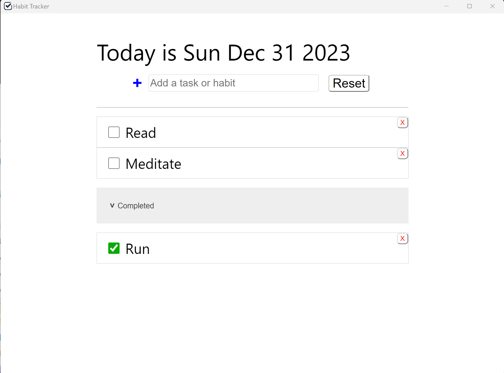

# Todo List
A simple todo list app built on Electron and React to run on Windows



## Download
Get the latest app on Windows from [Releases](https://github.com/edwinhung/todo-list/releases).

## Development

Clone the repo:
```bash
$ git clone https://github.com/edwinhung/todo-list.git
```

Go to project directory and install dependencies
```bash
$ cd todo-list && npm install
```

Start up the app in a window
```bash
$ npm run dev
```

To package the app, please refer to Electron's tutorial on [Electron Forge](https://www.electronjs.org/docs/latest/tutorial/tutorial-packaging).


## Acknowledgment
This project was scaffolded with [electron-vite](https://github.com/alex8088/electron-vite) thanks to alex8088.